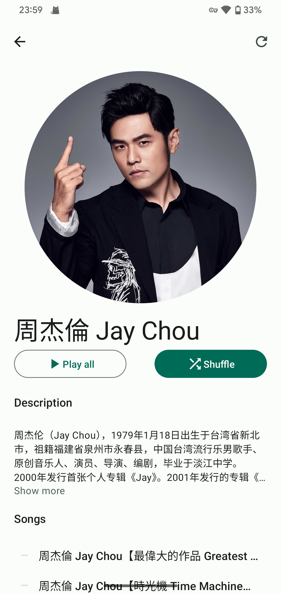
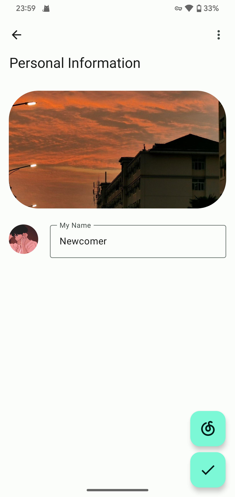

 
	

    
     
    
    <h1 align="center">
	Lark
</h1>

  网易云音乐以及 Youtube Music 播放器，使用 Jetpack Compose 开发

 <a href="https://github.com/mumu12641/Lark/blob/master/README.md">English</a> 
&nbsp;&nbsp;| &nbsp;&nbsp;
简体中文

## :framed_picture: 屏幕截图

## :book:功能特色

- :floppy_disk:获取并播放本地歌曲
- :rocket:导入来自网易云音乐以及 Youtube Music 的歌单
- :bulb:根据当前播放歌曲更改主题
- :art:遵循 [Material Design 3](https://m3.material.io/) 设计规范，实现了 [动态色彩](https://m3.material.io/foundations/customization) 主题的应用界面 

## :pushpin:计划

- :sparkles:UI设计
- :mag_right:搜索来自网易云音乐以及 Youtube Music 的歌曲
- :link:更多音源

## :open_file_folder:下载

请从 [releases](https://github.com/mumu12641/Lark/releases) 下载 apk 安装

## :hearts:致谢

 [Seal](https://github.com/JunkFood02/Seal)

 [RetroMusicPlayer](https://github.com/RetroMusicPlayer/RetroMusicPlayer)

 [Howl](https://github.com/Iamlooker/Howl)

[NeteaseCloudMusicApi](https://github.com/Binaryify/NeteaseCloudMusicApi).

[yt_dlp](https://github.com/yt-dlp/yt-dlp) 

[youtubedl-android](https://github.com/yausername/youtubedl-android)

[material color utilities](https://github.com/material-foundation/material-color-utilities).

## :scroll:开源许可证

[Apache License Version 2.0](https://github.com/mumu12641/Lark/blob/master/LICENSE)