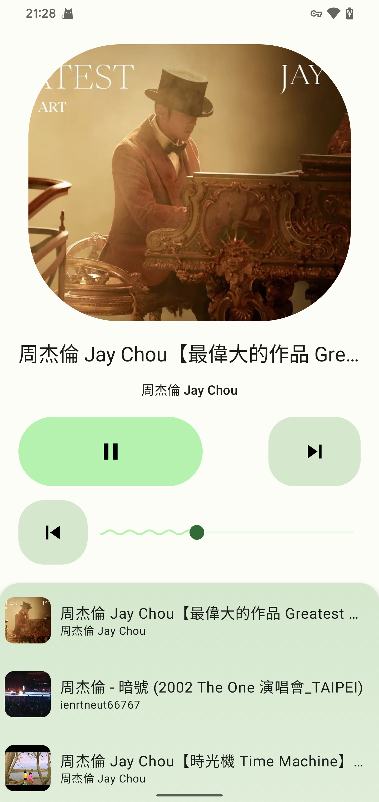

 
	

<h1 align="center">
	Lark
</h1>

	NetEase Cloud Music and Local Music Player,developed using Jetpack Compose

## ScreenShot

## Features

- Fetch local music to play
- [Material Design 3](https://m3.material.io/) style UI, with [dynamic color](https://m3.material.io/foundations/customization) theme.

- MAD: UI and logic written with pure Kotlin. Single activity, no fragments, only composable destinations.

## What's Next

- UI development
- Fetch songs from Netease Cloud Music to play

## Download

Please download apk from [releases](https://github.com/mumu12641/Lark/releases)

## Thanks

Some code is borrowed from [Seal](https://github.com/JunkFood02/Seal),and UI design inspired by [RetroMusicPlayer](https://github.com/RetroMusicPlayer/RetroMusicPlayer) and [Howl](https://github.com/Iamlooker/Howl).

API service from [NeteaseCloudMusicApi](https://github.com/Binaryify/NeteaseCloudMusicApi).

Material design from [material color utilities](https://github.com/material-foundation/material-color-utilities).

## LICENSE

[Apache License Version 2.0](https://github.com/mumu12641/Lark/blob/master/LICENSE)