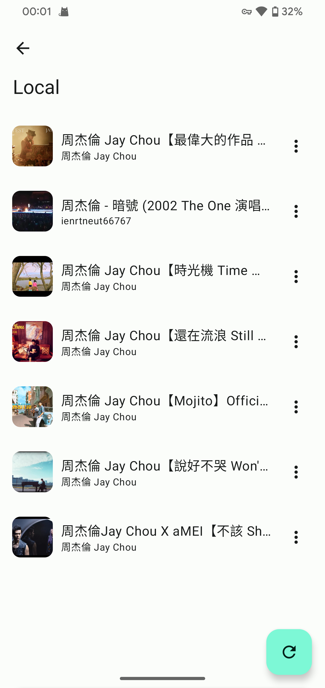

 
	

<h1 align="center">
	Lark
</h1>

  Netease Cloud Music and Local Music Player,developed using Jetpack Compose

## :framed_picture: ScreenShot

## :book:Features

- :floppy_disk:Fetch local music to play
- :rocket:Import songlists from Netease Music
- :bulb:Adaptive play theme with currently playing song
- :art: [Material Design 3](https://m3.material.io/) style UI, with [dynamic color](https://m3.material.io/foundations/customization) theme、custom theme and play page that changes with the album cover

## :pushpin:What's Next

- :sparkles:UI development
- :mag_right:Search songs from Netease Music
- :link:More sound source

## :open_file_folder:Download

Please download apk from [releases](https://github.com/mumu12641/Lark/releases)

## :hearts:Thanks

Some code is borrowed from [Seal](https://github.com/JunkFood02/Seal),and UI design inspired by [RetroMusicPlayer](https://github.com/RetroMusicPlayer/RetroMusicPlayer) and [Howl](https://github.com/Iamlooker/Howl).

API service from [NeteaseCloudMusicApi](https://github.com/Binaryify/NeteaseCloudMusicApi).

Material design from [material color utilities](https://github.com/material-foundation/material-color-utilities).

## :scroll:LICENSE

[Apache License Version 2.0](https://github.com/mumu12641/Lark/blob/master/LICENSE)